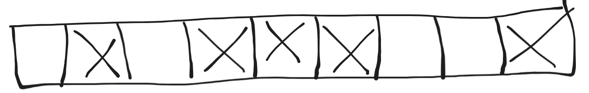

Khi còn học trên giảng đường, các bạn thường được nghe giảng rằng một trong những điểm khác biệt lớn giữa những ngôn ngữ như Java, Python, JS, C#,... so với C/C++ đó là những ngôn ngữ đó có tích hợp sẵn Garbage Collection, tức là khi chúng ta khai báo các object thì chúng ta sẽ không cần phải gọi `delete` để dọn vùng nhớ được cấp phát cho các object thủ công như C/C++ nữa mà những Garbage Collection đó sẽ tự làm những công việc đó tự động thay cho chúng ta. Cơ mà, biết là Garbage Collection rất tiện nhưng liệu các bạn có thật sự biết nó làm gì bên trong để dọn vùng nhớ cho chúng ta không? Hãy cùng tìm hiểu trong bài viết này nhé.

# Nhắc lại và bổ sung một số kiến thức về vùng nhớ

Khi khởi chạy, các chương trình sẽ tạo ra các tiến trình (process) tương ứng; mỗi tiến trình sẽ có 1 vùng nhớ riêng biệt, cô lập ở trên RAM và không share chung vùng nhớ với các tiến trình khác. Trên thực tế, khi làm việc với các vùng nhớ trong các chương trình, chúng ta không thật sự "tương tác" trực tiếp với RAM, mà thực chất hệ điều hành sẽ cho chương trình 1 vùng nhớ ảo (virtual memory) để xử lý trên đó. Trên thực tế vùng nhớ ảo có thể hiểu đơn giản như 1 interface để tương tác với vùng nhớ vật lý thật, công dụng của nó dùng để ngăn chặn việc các chương trình cố gắng can thiệp vào vùng nhớ thật để gây hại cho hệ thống. Đó là lý do khi sử dụng các lệnh log để in ra địa chỉ của các object thì nó là địa chỉ của vùng nhớ ảo chứ không phải địa chỉ của vùng nhớ thật. Mặc định thì với hệ điều hành 32 bit thì sẽ cấp phát tối đa mỗi tiến trình là 2GB vùng nhớ ảo còn 64 bit là 8TB.

## Các trạng thái của vùng nhớ ảo

Vùng nhớ ảo, hay cụ thể hơn là các block vùng nhớ của nó, sẽ có 3 trạng thái sau:

| Trạng thái | Mô tả |
| -----------| ----- |
| Free | Không có ai đang sử dụng block vùng nhớ này và có thể được cấp phát.  |
| Reserved | Block vùng nhớ này đã "xin đăng ký" để sử dụng và không được phép cấp phát cho bất kỳ chương trình nào khác. Tuy nhiên dữ liệu vẫn không thể được lưu lên block này do hệ điều hành commited. |
| Commited | Vùng nhớ đã được đăng ký lên vùng nhớ vật lý. |

Về reserved và commited, các bạn có thể hiểu reserved như là đã đặt bàn ăn trước ngày hẹn còn commited là khi bạn đến ngày hẹn và được phép sử dụng bàn đã đặt.

## Vùng nhớ bị phân mảnh (fragment)

Khi chương trình chạy đến những đoạn code cần cấp phát vùng nhớ, như `new Foo()` chẳng hạn, thì chương trình sẽ yêu cầu 1 vùng nhớ với kích thước của `Foo`. Nếu `Foo` có kích thước là 4 ô nhớ (ở đây mình sẽ gọi chung là ô nhớ như đơn vị nhỏ nhất) thì chương trình sẽ yêu cầu cấp 1 block với 4 ô nhớ nằm liền kề nhau để lưu thông tin từ object của `Foo`. Tuy nhiên đời không như là mơ, không phải lúc nào chúng ta cũng thuận lợi yêu cầu là có ngay block để xài. Sẽ có nhiều tình huống dù cho số lượng ô nhớ free còn lại đủ để cấp phát theo yêu cầu nhưng do các ô nhớ đó lại nằm rời rạc nhau nên việc cấp phát sẽ thất bại. Việc những ô nhớ bị rời rạc như thế này còn được gọi là vùng nhớ bị phân mảnh (phân thành nhiều mảnh nhỏ).

Như hình trên, ta thấy rằng dù số ô nhớ free là 4 (những ô không đánh dấu X) nhưng do chúng nằm rời rạc nhau nên chương trình không thể yêu cầu cấp phát vùng nhớ cho object của `Foo` được.

## Vùng nhớ page file

# Tài liệu tham khảo

Trong quá trình viết bài mình có tham khảo một số tài liệu sau:
 * https://learn.microsoft.com/en-us/dotnet/standard/garbage-collection/fundamentals
