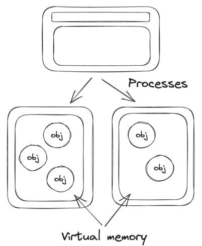
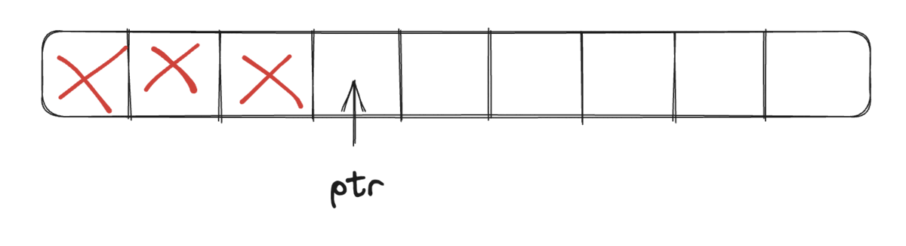
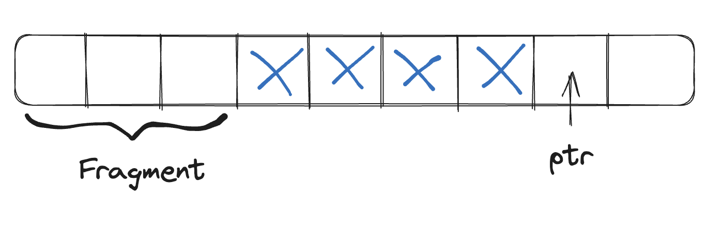
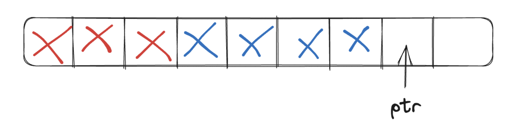
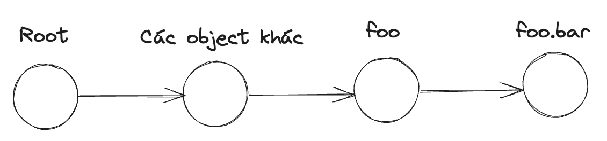

Khi còn học trên giảng đường, các bạn thường được nghe giảng rằng một trong những điểm khác biệt lớn giữa những ngôn ngữ như Java, Python, JS, C#,... so với C/C++ đó là những ngôn ngữ đó có tích hợp sẵn garbage collector, tức là khi chúng ta khai báo các object thì chúng ta sẽ không cần phải gọi `delete` để dọn vùng nhớ được cấp phát cho các object thủ công như C/C++ nữa mà những garbage collector đó sẽ tự làm những công việc đó tự động thay cho chúng ta. Cơ mà, biết là tự động dọn như thế thì rất tiện nhưng liệu các bạn có thật sự biết nó làm gì bên trong để dọn vùng nhớ cho chúng ta không? Hãy cùng tìm hiểu trong bài viết này nhé.

## Nhắc lại và bổ sung một số kiến thức về vùng nhớ

Khi khởi chạy, các chương trình sẽ tạo ra các tiến trình (process) tương ứng; mỗi tiến trình sẽ có 1 vùng nhớ riêng biệt, cô lập ở trên vùng nhớ vật lý (RAM) và không share chung vùng nhớ với các tiến trình khác. Trên thực tế, khi làm việc với các vùng nhớ trong các chương trình, chúng ta không thật sự "tương tác" trực tiếp với vùng nhớ vật lý, mà thực chất hệ điều hành sẽ cho chương trình 1 vùng nhớ ảo (virtual memory) để xử lý trên đó. Chúng ta có thể hiểu nó như 1 interface để tương tác với vùng nhớ vật lý, công dụng của nó dùng để ngăn chặn việc các chương trình cố gắng can thiệp vào vùng nhớ vật lý để gây hại cho hệ thống. Đó là lý do khi sử dụng các lệnh log để in ra địa chỉ của các object thì nó là địa chỉ của vùng nhớ ảo chứ không phải địa chỉ của vùng nhớ vật lý. Mặc định thì với hệ điều hành 32 bit thì sẽ cấp phát tối đa mỗi tiến trình là 2GB vùng nhớ ảo còn 64 bit là 8TB.



### Các trạng thái của vùng nhớ ảo

Vùng nhớ ảo, hay cụ thể hơn là các block vùng nhớ của nó, sẽ có 3 trạng thái sau:

| Trạng thái | Mô tả |
| -----------| ----- |
| Free | Không có ai đang sử dụng block vùng nhớ này và có thể được cấp phát.  |
| Reserved | Block vùng nhớ này đã "xin đăng ký" để sử dụng và không được phép cấp phát cho bất kỳ chương trình nào khác. Tuy nhiên dữ liệu vẫn không thể được lưu lên block này do hệ điều hành chưa commited. |
| Commited | Vùng nhớ đã được đăng ký lên vùng nhớ vật lý. |

Về reserved và commited, các bạn có thể hiểu reserved như là đã đặt bàn ăn trước ngày hẹn, tức là không ai có thể đặt hay sử dụng bàn đó nữa nhưng bạn cũng chưa được sử dụng nốt do chưa đến ngày hẹn còn commited là khi bạn đến nhà hàng vào ngày hẹn và được phép sử dụng bàn đã đặt.

### Vùng nhớ bị phân mảnh (fragment)

Khi chương trình chạy đến những đoạn code cần cấp phát vùng nhớ, như `new Foo()` chẳng hạn, thì chương trình sẽ yêu cầu 1 vùng nhớ với kích thước của `Foo`. Nếu `Foo` có kích thước là 4 ô nhớ (ở đây mình sẽ gọi chung là ô nhớ như đơn vị nhỏ nhất) thì chương trình sẽ yêu cầu cấp 1 block với 4 ô nhớ nằm liền kề nhau để lưu thông tin từ object của `Foo`. Tuy nhiên đời không như là mơ, không phải lúc nào chúng ta cũng thuận lợi yêu cầu cấp phát là có ngay block để xài. Sẽ có nhiều tình huống dù cho số lượng ô nhớ free còn lại đủ để cấp phát theo yêu cầu nhưng do các ô nhớ đó lại nằm rời rạc nhau nên việc cấp phát sẽ thất bại. Việc những ô nhớ bị rời rạc như thế này còn được gọi là vùng nhớ bị phân mảnh (phân thành nhiều mảnh nhỏ).


Như hình trên, ta thấy rằng dù số ô nhớ free là 4 (những ô không đánh dấu X) nhưng do chúng nằm rời rạc nhau nên chương trình không thể yêu cầu cấp phát vùng nhớ cho object của `Foo` được.

### Vùng nhớ heap (managed heap)

Như đã đề cập, khi chương trình khởi chạy nó sẽ tạo ra 1 tiến trình và yêu cầu hệ điều hành cấp 1 vùng nhớ ảo cho tiến trình đó. Khi chúng ta khởi tạo 1 object trong chương trình, chúng ta không thực chất tương tác trực tiếp với vùng nhớ ảo này, mà runtime của chương trình sẽ tạo ra 1 "layer" mới trên vùng nhớ ảo này giúp các object khởi tạo vào đó và còn được gọi là vùng nhớ heap (managed heap). Như vậy có thể hiểu rằng vùng nhớ ảo là do tiến trình quản lý còn các managed heap sẽ do runtime của chương trình quản lý giúp tương tác với vùng nhớ ảo. Nếu các bạn sử dụng các native code trong chương trình thì có thể can thiệp vào vùng nhớ ảo trực tiếp luôn.

Tóm lại về cơ bản chúng ta có 3 layer của vùng nhớ:
* Vùng nhớ vật lý (physical memory hay RAM) do hệ điều hành quản lý.
* Vùng nhớ ảo (virtual memory hay virtual address space) do tiến trình quản lý.
* Vùng nhớ heap (managed heap) do chương trình quản lý.


Vùng nhớ ảo có thể mở rộng đến kích thước tối đa cho phép của 1 tiến trình (2GB cho 32bit và 8TB cho 64bit) và vùng nhớ heap có thể mở rộng tối đa đến kích thước hiện tại của vùng nhớ ảo đang chứa nó.

### Cấp phát vùng nhớ (allocation)

Để cấp phát vùng nhớ cho object mới thì chương trình cũng sẽ sử dụng 1 con trỏ (pointer) trỏ vào địa chỉ nơi mà object tiếp theo được khởi tạo sẽ được đặt vào đó. Sau khi object tiếp theo được khởi tạo, vị trí của con trỏ được cập nhật và dời xuống cuối block nhớ của object vừa được tạo.



### Giải phóng vùng nhớ (deallocation)

Không phải lúc nào chúng ta cũng có thể cấp phát liên tục vùng nhớ mới vì tài nguyên là có hạn. Sẽ có những lúc chúng ta buộc phải nói lời chia tay (giải phóng) với những object đã tạo trước đó để dành chỗ cho những object mới. Khi một object được xem là unreachable object và điều kiện kích hoạt garbage collector đã thỏa mãn (phần sau chúng ta sẽ đi sâu vào mấy cái này) thì garbage collector sẽ bắt đầu việc thu dọn và giải phóng những vùng nhớ không còn sử dụng nữa. Garbage collector chỉ đơn giản duyệt qua các object không còn xài nữa, gọi đến native API để đánh dấu là ô nhớ của object đó là unallocated. Tuy nhiên hạn chế của phương pháp này là sẽ gây ra hiện tượng vùng nhớ phân mảnh như đã đề cập.



Để giải quyết vấn đề này thì các garbage collector sẽ sử dụng phương pháp compact hoặc di dời vùng nhớ. Phương pháp này sử dụng kỹ thuật two pointers rất phổ biến (ít nhất là đối với đám chuyên giải competitive programming hay Leetcode). Về cơ bản, ngoài con trỏ mình đã đề cập ở phần trên (tạm gọi là `right_ptr`), thì chúng ta sẽ có thêm 1 con trỏ (tạm gọi là `left_ptr`) nữa duyệt từ đầu đến cuối vùng nhớ. Trong quá trình duyệt, nó sẽ tìm những ô nhớ chưa được sử dụng (unallocated) và dừng lại sau khi đã tìm thấy. Con trỏ `right_ptr` thì ngược lại, duyệt từ cuối đến đầu vùng nhớ và dừng nếu thấy có ô nhớ nào đang được sử dụng. Khi `left_ptr` trỏ vào ô nhớ chưa được sử dụng và `right_ptr` trỏ vào ô nhớ đang được sử dụng, thuật toán sẽ swap giá trị của 2 con trỏ, đồng thời đặt vào vị trí của `right_ptr` 1 tham chiếu đến vị trí của `left_ptr`. Tham chiếu này được sử dụng để cập nhật địa chỉ của những tham chiếu khác trỏ vào vị trí cũ của object khi còn ở `right_ptr`. Khó hiểu quá phải không, nói đơn giản là ví dụ quán ăn nhà các bạn đang ở `right_ptr`, khi các bạn dọn quán sang địa chỉ mới `left_ptr` thì thông thường các bạn sẽ treo 1 tấm biển kiểu như "đã dọn quán sang `left_ptr`" để những khách hàng từng ăn trước đó biết địa chỉ mới của các bạn.



## Một số khái niệm cơ bản trong garbage collector

Như đã đề cập ở trên, khi một object là unreachable object thì tức là object đó không còn được sử dụng nữa và có thể được giải phóng khi các điều kiện đã thỏa mãn. Vậy khi nào 1 object được xem là không còn được sử dụng nữa và những điều kiện cần thiết để garbage collector được kích hoạt là gì?

### Unreachable objects

Khi runtime của chương trình bắt đầu chạy, nó sẽ tạo ra đồ thị các tham chiếu giữa các object. Mỗi đỉnh trên đồ thị là 1 object còn các cạnh nối giữa các object là các tham chiếu. Các đỉnh xuất phát được gọi là root, những đỉnh này có thể giống như hàm main của chương trình, stack,...

```javascript
const foo = new Foo();
foo.bar = new Bar();
```



Như hình trên, đầu tiên mình tạo object `foo`, sau đó là khởi tạo object `bar` trong `foo`, như vậy tức là ta có tham chiếu đi từ `foo` đến `bar`. Ngoài ra, trước `foo` còn có thể có những object khác dẫn đến `foo` và xuất phát từ root chẳng hạn. Lúc này chắc các bạn có thể đoán được: những object nào có tham chiếu, hay đường đi từ root đến nó thì là reachable object còn những object nào không có đường đi sẽ là unreachable object. Đó là những object không còn được sử dụng nữa và có thể được thu dọn. Một ví dụ dễ hiểu cho unreachable object mà có thể các bạn hay gặp:

```javascript
function getText() {
  return (new Text('lorem ipsum')).text;
}
```

Ở hàm `getText()`, chúng ta khai báo object trong cụm `new Text('lorem ipsum')`, sau đó chúng ta lấy giá trị từ `text` và trả về kết quả. Như vậy sau khi hàm `getText()` được trả về thì object được khởi tạo bên trong cũng đã mất đi tham chiếu từ root đến nó và trở thành unreachable object.

### Điều kiện để kích hoạt garbage collector

Giả sử chúng ta có 1 loạt các unreachable object rồi thì tiếp theo sẽ thế nào? Garbage collector sẽ bắt đầu đi dọn dẹp ngay sao? Tất nhiên là không. Thông thường quá trình dọn rác sẽ không diễn ra liên tục theo thời gian thực (real-time) mà sẽ có những điều kiện riêng để garbage collector bắt đầu đi dọn rác. Những điều kiện đó như sau:

* Dung lượng của vùng nhớ vật lý của hệ thống đang thấp. Hệ điều hành sẽ quản lý việc kiểm soát vùng nhớ này và nó sẽ ra thông báo cho chương trình khi vùng nhớ có dung lượng thấp.
* Thông thường runtime sẽ set 1 ngưỡng (threshold) dung lượng cho vùng nhớ heap. Ngưỡng này có thể tăng hoặc giảm tùy theo điều kiện của chương trình lúc đó. Nếu tổng dung lượng từ các object đang có vượt quá ngưỡng này thì garbage collector sẽ tiến hành dọn các unreachable objects. Nếu dọn xong mà vẫn vượt threshold thì sẽ gọi đến runtime để tăng threshold lên (thường xảy ra khi gọi Factory để tạo hàng loạt object hay import một lượng lớn data vào mảng chẳng hạn).
* Hàm GC được gọi, cái này thì hên xui tùy theo ngôn ngữ. Có ngôn ngữ support gọi trực tiếp garbage collector có ngôn ngữ thì không.
* Object là large object, tức là những object có kích thước lớn hơn 1 giới hạn nào đó (mỗi ngôn ngữ sẽ mỗi khác, như C# là [85000 byte](https://learn.microsoft.com/en-us/dotnet/standard/garbage-collection/fundamentals#:~:text=The%20large%20object%20heap%20contains%20objects%20that%20are%2085%2C000%20bytes%20and%20larger)). Mặc định thì runtime sẽ chia heap thành nhiều generation khác nhau, và 1 trong số những generation đó là dành cho large object. Các object thông thường thì khi unreachable phải đợi đến khi thỏa 1 trong những điều kiện trên thì garbage collector mới dọn; riêng large object thì chỉ cần unreachable là garbage collector sẽ dọn nó luôn.

Tất nhiên không phải ngôn ngữ nào cũng áp dụng những điều kiện này. Một số ngôn ngữ như Rust, Python sử dụng cơ chế dọn rác khác so với thông thường thì ngay khi một 1 object là unreachable thì sẽ bị thu hồi ngay lập tức. Ở phần sau chúng ta sẽ tìm hiểu qua những thuật toán để garbage collector truy ra được những unreachable object và sự khác nhau giữa các loại garbage collector giữa những ngôn ngữ như Java, C#, JavaScript,... và Rust, Python,...

## Tài liệu tham khảo

Trong quá trình viết bài mình có tham khảo một số tài liệu sau:
 * https://learn.microsoft.com/en-us/dotnet/standard/garbage-collection/fundamentals
