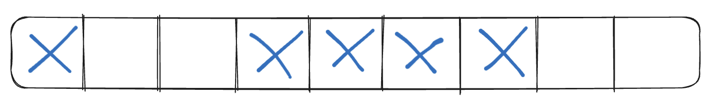

Khi còn học trên giảng đường, các bạn thường được nghe giảng rằng một trong những điểm khác biệt lớn giữa những ngôn ngữ như Java, Python, JS, C#,... so với C/C++ đó là những ngôn ngữ đó có tích hợp sẵn garbage collector, tức là khi chúng ta khai báo các object thì chúng ta sẽ không cần phải gọi `delete` để dọn vùng nhớ được cấp phát cho các object thủ công như C/C++ nữa mà những garbage collector đó sẽ tự làm những công việc đó tự động thay cho chúng ta. Cơ mà, biết là tự động dọn như thế thì rất tiện nhưng liệu các bạn có thật sự biết nó làm gì bên trong để dọn vùng nhớ cho chúng ta không? Hãy cùng tìm hiểu trong bài viết này nhé.

## Nhắc lại và bổ sung một số kiến thức về vùng nhớ

Khi khởi chạy, các chương trình sẽ tạo ra các tiến trình (process) tương ứng; mỗi tiến trình sẽ có 1 vùng nhớ riêng biệt, cô lập ở trên vùng nhớ vật lý (RAM) và không share chung vùng nhớ với các tiến trình khác. Trên thực tế, khi làm việc với các vùng nhớ trong các chương trình, chúng ta không thật sự "tương tác" trực tiếp với vùng nhớ vật lý, mà thực chất hệ điều hành sẽ cho chương trình 1 vùng nhớ ảo (virtual memory) để xử lý trên đó. Chúng ta có thể hiểu nó như 1 interface để tương tác với vùng nhớ vật lý, công dụng của nó dùng để ngăn chặn việc các chương trình cố gắng can thiệp vào vùng nhớ vật lý để gây hại cho hệ thống. Đó là lý do khi sử dụng các lệnh log để in ra địa chỉ của các object thì nó là địa chỉ của vùng nhớ ảo chứ không phải địa chỉ của vùng nhớ vật lý. Mặc định thì với hệ điều hành 32 bit thì sẽ cấp phát tối đa mỗi tiến trình là 2GB vùng nhớ ảo còn 64 bit là 8TB.

### Các trạng thái của vùng nhớ ảo

Vùng nhớ ảo, hay cụ thể hơn là các block vùng nhớ của nó, sẽ có 3 trạng thái sau:

| Trạng thái | Mô tả |
| -----------| ----- |
| Free | Không có ai đang sử dụng block vùng nhớ này và có thể được cấp phát.  |
| Reserved | Block vùng nhớ này đã "xin đăng ký" để sử dụng và không được phép cấp phát cho bất kỳ chương trình nào khác. Tuy nhiên dữ liệu vẫn không thể được lưu lên block này do hệ điều hành chưa commited. |
| Commited | Vùng nhớ đã được đăng ký lên vùng nhớ vật lý. |

Về reserved và commited, các bạn có thể hiểu reserved như là đã đặt bàn ăn trước ngày hẹn, tức là không ai có thể đặt hay sử dụng bàn đó nữa nhưng bạn cũng chưa được sử dụng nốt do chưa đến ngày hẹn còn commited là khi bạn đến nhà hàng vào ngày hẹn và được phép sử dụng bàn đã đặt.

### Vùng nhớ bị phân mảnh (fragment)

Khi chương trình chạy đến những đoạn code cần cấp phát vùng nhớ, như `new Foo()` chẳng hạn, thì chương trình sẽ yêu cầu 1 vùng nhớ với kích thước của `Foo`. Nếu `Foo` có kích thước là 4 ô nhớ (ở đây mình sẽ gọi chung là ô nhớ như đơn vị nhỏ nhất) thì chương trình sẽ yêu cầu cấp 1 block với 4 ô nhớ nằm liền kề nhau để lưu thông tin từ object của `Foo`. Tuy nhiên đời không như là mơ, không phải lúc nào chúng ta cũng thuận lợi yêu cầu cấp phát là có ngay block để xài. Sẽ có nhiều tình huống dù cho số lượng ô nhớ free còn lại đủ để cấp phát theo yêu cầu nhưng do các ô nhớ đó lại nằm rời rạc nhau nên việc cấp phát sẽ thất bại. Việc những ô nhớ bị rời rạc như thế này còn được gọi là vùng nhớ bị phân mảnh (phân thành nhiều mảnh nhỏ).



Như hình trên, ta thấy rằng dù số ô nhớ free là 4 (những ô không đánh dấu X) nhưng do chúng nằm rời rạc nhau nên chương trình không thể yêu cầu cấp phát vùng nhớ cho object của `Foo` được.

### Cấp phát vùng nhớ

Như đã đề cập, khi chương trình khởi chạy nó sẽ tạo ra 1 tiến trình và yêu cầu hệ điều hành cấp 1 vùng nhớ ảo cho tiến trình đó. Khi chúng ta khởi tạo 1 object trong chương trình, chúng ta không thực chất tương tác trực tiếp với vùng nhớ ảo này, mà runtime của chương trình sẽ tạo ra 1 "layer" mới trên vùng nhớ ảo này giúp các object khởi tạo vào đó và còn được gọi là vùng nhớ heap (managed heap). Như vậy có thể hiểu rằng vùng nhớ ảo là do tiến trình quản lý còn các managed heap sẽ do runtime của chương trình quản lý giúp tương tác với vùng nhớ ảo. Nếu các bạn sử dụng các native code trong chương trình thì có thể can thiệp vào vùng nhớ ảo trực tiếp luôn.

Tóm lại về cơ bản chúng ta có 3 layer của vùng nhớ:
* Vùng nhớ vật lý (physical memory hay RAM) do hệ điều hành quản lý.
* Vùng nhớ ảo (virtual memory hay virtual address space) do tiến trình quản lý.
* Vùng nhớ heap (managed heap) do chương trình quản lý.


Vùng nhớ ảo có thể mở rộng đến kích thước tối đa cho phép của 1 tiến trình (2GB cho 32bit và 8TB cho 64bit) và vùng nhớ heap có thể mở rộng tối đa đến kích thước hiện tại của vùng nhớ ảo đang chứa nó.

Để quản lý heap thì chương trình cũng sẽ sử dụng 1 con trỏ (pointer) trỏ vào địa chỉ nơi mà đối tượng tiếp theo được khởi tạo sẽ được đặt vào đó.


### Giải phóng vùng nhớ

Garbage collector của các ngôn ngữ sẽ có những cơ chế riêng để quyết định xem khi nào là phù hợp để đi "dọn rác". Về cơ bản, những garbage collector này sẽ duyệt qua các object đang có trong chương trình, bắt đầu từ entry point hay root của chương trình và đi qua các object, các field là object bên trong object,... và từ đó lập ra đồ thị kết nối giữa các object với nhau. Ví dụ, nếu object `Foo` có 1 field bên trong là object `Bar`, khi đó đồ thị sẽ có cạnh nối giữa 2 object với nhau chứng tỏ object `Bar` có đường đi đến thông qua `Foo`. Lúc này chắc các bạn cũng đoán được, những object nào không có đường đi trong đồ thị xuất phát từ root (unreachable objects) thì những object đó không còn được sử dụng nữa và sẵn sàng để thu hồi.

```java
public static void main() {
    Foo foo = new Foo();
    foo.barObj = new Bar();
}
```


Cơ chế giải phóng vùng nhớ nếu giải thích cơ bản thì cũng cực kỳ đơn giản. Nó chỉ đơn giản là copy mớ reachable objects và ghép lại sát với nhau trên vùng nhớ heap, xong rồi set lại vị trí con trỏ của vùng nhớ heap là xong, phần còn lại sẽ là unreachable objects và garbage collectior sẽ call xuống native giải phóng.


Giả sử chúng ta có 3 object A (3 ô nhớ), B (4 ô nhớ), C (3 ô nhớ) như hình, pointer của heap đang trỏ vào ô nhớ phía sau C và object B hiện đang unreachable. Garbage collector sẽ tiến hành copy 3 ô nhớ từ object C sang kế object A và set lại vị trí của pointer:


Thông thường quá trình dọn rác sẽ không diễn ra liên tục theo thời gian thực (real-time) mà sẽ có những điều kiện riêng để garbage collector bắt đầu đi dọn rác. Những điều kiện đó như sau:

* Dung lượng của vùng nhớ vật lý của hệ thống đang thấp. Hệ điều hành sẽ quản lý việc kiểm soát vùng nhớ này và nó sẽ ra thông báo cho chương trình khi vùng nhớ có dung lượng thấp.
* Thông thường runtime sẽ set 1 ngưỡng (threshold) dung lượng cho vùng nhớ heap. Ngưỡng này có thể tăng hoặc giảm tùy theo điều kiện của chương trình lúc đó. Nếu tổng dung lượng từ các object đang có vượt quá ngưỡng này thì garbage collector sẽ tiến hành dọn các unreachable objects. Nếu dọn xong mà vẫn vượt threshold thì sẽ gọi đến runtime để tăng threshold lên (thường xảy ra khi gọi Factory để tạo hàng loạt object hay import một lượng lớn data vào mảng chẳng hạn).
* Hàm GC được gọi, cái này thì hên xui tùy theo ngôn ngữ. Có ngôn ngữ support gọi trực tiếp garbage collector có ngôn ngữ thì không.
* Object là large object, tức là những object có kích thước lớn hơn 1 giới hạn nào đó (mỗi ngôn ngữ sẽ mỗi khác, như C# là [85000 byte](https://learn.microsoft.com/en-us/dotnet/standard/garbage-collection/fundamentals#:~:text=The%20large%20object%20heap%20contains%20objects%20that%20are%2085%2C000%20bytes%20and%20larger)). Mặc định thì runtime sẽ chia heap thành nhiều generation khác nhau, và 1 trong số những generation đó là dành cho large object. Các object thông thường thì khi unreachable phải đợi đến khi thỏa 1 trong những điều kiện trên thì garbage collector mới dọn; riêng large object thì chỉ cần unreachable là garbage collector sẽ dọn nó luôn.

## Generation của garbage collector

Thuật toán của garbage collector dựa trên những yếu tố sau nhằm tối ưu việc dọn dẹp:

* Copy một phần nhỏ trong vùng nhớ heap sẽ nhanh hơn so với cả 1 vùng nhớ heap.
* Các object mới tạo thường có xu hướng sẽ có "thời gian tồn tại" (short-lived lifetime) ngắn hơn so với những object đã xuất hiện từ lâu (long-lived lifetime).
* Các object mới tạo thường sẽ phụ thuộc vào nhau và có thể được truy cập bởi chương trình trong 1 "khoảng thời gian". Ví dụ như trong hàm `foo()` các bạn khai báo các object bên trong thì những object đó sẽ chỉ được sử dụng bên trong hàm `foo()` đó và hết tác dụng khi hàm kết thúc.

Thông thường thì garbage collector đa số sẽ đi dọn những short-lived objects trong suốt cả chương trình hơn là những long-lived objects. Điều này cũng có nghĩa là số lượng short-lived objects, hay nói dễ hiểu là những object vừa tạo ra xong và xài có một lúc là đã không còn cần thiết nữa, là rất nhiều. Để tối ưu hóa, runtime sẽ chia vùng nhớ heap thành 3 generation chính là 0, 1 và 2 để có thể quản lý các short-lived và long-lived objects cho hiệu quả. Giải thích cơ bản thì các object sẽ được lưu ở generation 0 khi vừa được tạo và nếu như nó "sống sót" sau quá trình dọn rác thì sẽ được đưa lên các generation tiếp theo. Như đã đề cập ở trên:
> Copy một phần nhỏ trong vùng nhớ heap sẽ nhanh hơn so với cả 1 vùng nhớ heap.

Do đó việc chia vùng nhớ heap thành nhiều phần sẽ giúp tối ưu trong việc copy vùng nhớ hơn vì garbage collector có thể chỉ cần phải thực hiện copy để dọn vùng nhớ ở 1 generation thôi là đủ thay vì phải copy toàn bộ vùng nhớ heap.

### Generation 0

Đây là generation "trẻ tuổi" nhất và dùng để chứa các short-lived objects. Một ví dụ đơn giản  dễ hiểu của short-lived object là những biến khai báo tạm như `const auth_token = (new AuthTokenGenerator(auth_context)).token`. Các bạn có thể thấy phần khai báo object `new AuthTokenGenerator` bên trong chỉ được sử dụng 1 lần duy nhất để lấy token và sau khi lấy token xong thì object đó cũng mất reference và trở thành unreachable object. Trên thực tế thì có rất nhiều những đoạn code với các object được khai báo chỉ xài đúng 1 hoặc chỉ vài lần trong 1 phạm vi nhỏ như các hàm xử lý đơn giản và nhanh nên đó cũng là lý do việc dọn rác sẽ thường xuyên diễn ra nhiều nhất ở generation 0.

Các object khi vừa khởi tạo sẽ nằm ở generation 0. Tuy nhiên, chúng ta vẫn còn đó 1 loại object khác mình đã nói ở trên: large object. Riêng loại này thì cho ra chỗ khác nằm, large object khi được tạo sẽ nằm trong vùng nhớ large object heap, đôi khi người ta gọi nó là generation 3 nhưng thực tế generation 3 này là 1 phần của generation 2. Ví dụ đơn giản nhất cho large object có lẽ là khi đọc từng dòng trong file text vào mảng, mỗi phần tử là 1 dòng. Nếu file có kích thước quá lớn thì lúc này mảng cũng sẽ có kích thước lớn theo và nó sẽ bị chuyển thành large object.

Đa số các object đều sẽ bị thu hồi ngay khi vẫn còn ở generation 0 và chỉ có một số ít mới "sống sót" và được chuyển lên các generation "già" hơn.

Nếu chương trình cố gắng tạo thêm object khi vùng nhớ generation 0 đã đầy thì garbage collector sẽ bắt đầu việc dọn dẹp vùng nhớ này để có thêm không gian trống. Ở đây, một lần nữa, copy 1 phần vùng nhớ sẽ nhanh hơn toàn bộ heap nên garbage collector sẽ chỉ kiểm tra và thu hồi vùng nhớ ở generation 0 và thông thường thì mỗi lần dọn generation 0 là đa số object trong đây cũng đi luôn.

### Generation 1

Đây có thể coi là generation trung gian giữa 0 và 1. Nếu xem generation 0 như sơ sinh thì generation 2 như là thiếu niên. Các object trong generation này vẫn được xem là short-lived objects. Sau khi garbage collector hoàn tất dọn dẹp generation 0, những object may mắn còn sống sót (như kiểu không nằm trong list layoff ấy) sẽ được copy và chuyển lên generation 1 (promote). Quy tắc hoạt động của các generation này khá đơn giản: những object nào không bị thu hồi vùng nhớ thì sẽ có xu hướng tồn tại lâu hơn trong chương trình, do đó việc đẩy những object này lên 1 generation cao hơn sau mỗi lần dọn vùng nhớ là hợp lý.

Việc dọn vùng nhớ các generation cũng đi theo nguyên lý từ thấp đến cao như sau: khi tạo mới 1 object, nếu generation 0 không đủ chỗ -> dọn generation 0. Nếu dọn generation 0 vẫn không đủ chỗ thì sẽ bắt đầu dọn sang generation 1 và sau đó là dọn generation 2. Khi dọn 1 generation thì những object còn sống sót ở generation đó sẽ được đẩy lên generation tiếp theo.


### Generation 2

Khi các object được đẩy lên generation 2 thì sẽ được gọi là long-lived objects. Một ví dụ thường gặp cho các long-lived objects là các property, hàm static có trong chương trình. Chúng được tạo ra từ đầu và thường sống sót đến cuối. Khi garbage collector dọn generation 2, những object còn sống sót vẫn tiếp tục ở đây đến khi nào unreachable.

```java
public static void main() {

}
```
Hàm `main` trong Java cũng là 1 ví dụ điển hình vì nó sẽ luôn sống sót qua các lần thu hồi vùng nhớ cho đến khi chương trình kết thúc.

Việc thu hồi một vùng nhớ có nghĩa là thu hồi từ những vùng nhớ thấp hơn đến thu hồi vùng nhớ đó. Ví dụ khi thực hiện thu hồi vùng nhớ generation 1 thì phải thu hồi ở generation 0 trước. Do đó, việc thu hồi ở generation 2 đôi khi còn được gọi là thu hồi toàn bộ vùng nhớ heap vì ta phải thu hồi từ 0 đến 1 rồi mới đến 2.

Như vậy ở phần đầu này chúng ta đã đi qua về một số kiến thức cơ bản và nâng cao về vùng nhớ cũng như tổng quan quy trình hoạt động của garbage collector. Ở phần sau mình sẽ giới thiệu về cách thức hoạt động bên trong của garbage collector xem thuật toán nó sử dụng là gì để thu dọn vùng nhớ.

# Tài liệu tham khảo

Trong quá trình viết bài mình có tham khảo một số tài liệu sau:
 * https://learn.microsoft.com/en-us/dotnet/standard/garbage-collection/fundamentals
