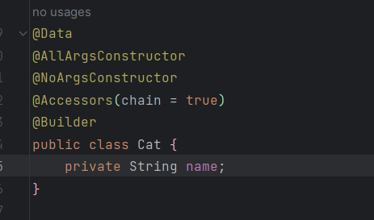
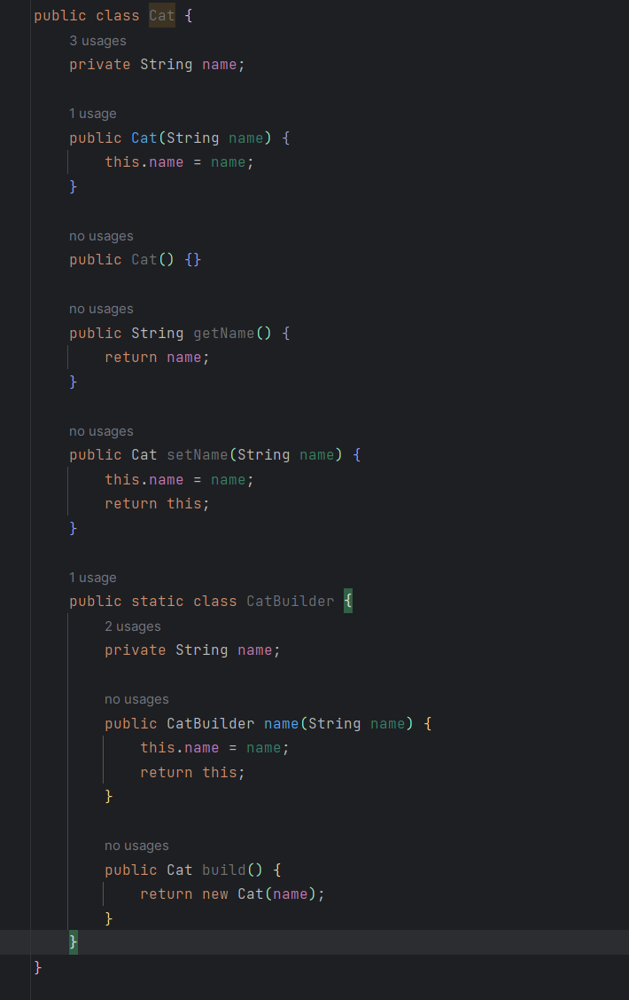
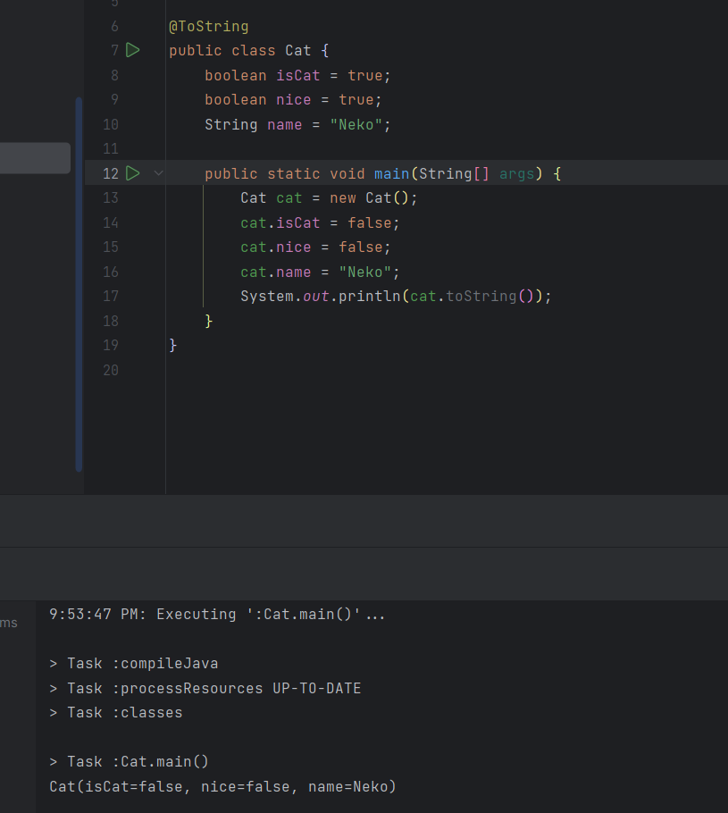
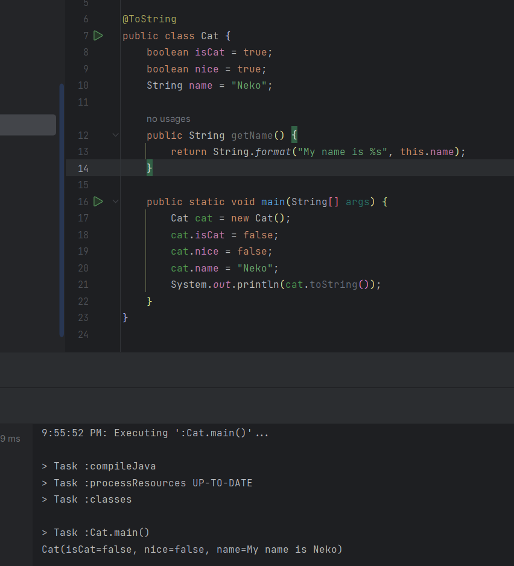

# Giới thiệu

Chào mọi người, Mèo đây! Đây là bài viết đầu tiên trong chuỗi bài viết về những thư viện thường dùng trong Java. Trong bài viết này, Mèo sẽ giới thiệu về thư viện Lombok.

Như chúng ta đã biết (hoặc chưa), Java là một ngôn ngữ lập trình có tính chặt chẽ rất cao, nhưng cũng bởi vì tính chặt chẽ cao đó mà Java tồn tại một **Pain point**, đó là code Java thuần túy rất dài dòng và rườm rà, và Lombok ra đời để giải quyết vấn đề đó.

Lombok là một thư viện Java giúp cho việc code Java trở nên ngắn gọn hơn, dễ đọc hơn, và dễ hiểu hơn. Lombok giúp chúng ta giảm thiểu được số lượng code mà chúng ta phải viết, nhưng vẫn đảm bảo được tính chặt chẽ của Java.

Dưới đây là một ví dụ ngắn về cách Lombok giúp chúng ta giảm thiểu được số lượng code mà chúng ta phải viết:





Như chúng ta có thể thấy, khi sử dụng Lombok, chúng ta chỉ cần viết **8** dòng code, trong khi nếu sử dụng Java thuần túy, chúng ta phải viết hơn **20** dòng code để đạt được kết quả tương tự.

Vậy, Lombok làm được điều đó như thế nào? Lombok có những khả năng gì? Cùng Mèo tìm hiểu nhé!

## Cài đặt

Link tải Lombok: [https://projectlombok.org/](https://projectlombok.org/)

### Gradle
```groovy
dependencies {
    compileOnly 'org.projectlombok:lombok:1.18.28'
    annotationProcessor 'org.projectlombok:lombok:1.18.28'

    testCompileOnly 'org.projectlombok:lombok:1.18.28'
    testAnnotationProcessor 'org.projectlombok:lombok:1.18.28'
}
```

### Maven
```maven
<dependencies>
	<dependency>
		<groupId>org.projectlombok</groupId>
		<artifactId>lombok</artifactId>
		<version>1.18.28</version>
		<scope>provided</scope>
	</dependency>
</dependencies>
```

## Các tính năng chính của Lombok

Lombok sử dụng các **Annotation** để thực hiện các tính năng của nó. Dưới đây là một số tính năng chính của Lombok:

### @Getter và @Setter

Annotation `@Getter` và `@Setter` giúp chúng ta tự động tạo các **getter** và **setter** cho các thuộc tính của một class.

**Getter** được tạo ra đơn giản là một method trả về giá trị của thuộc tính đó.
Mặc định, tên của method **getter** sẽ là `get<PropertyName>`, trong đó `PropertyName` là tên của thuộc tính.
Ví dụ, nếu chúng ta có một thuộc tính `name`, thì method **getter** sẽ có tên là `getName`.
Nếu kiểu dữ liệu của thuộc tính là `boolean`, thì tên của method **getter** sẽ là `is<PropertyName>`.
Ví dụ, nếu chúng ta có một thuộc tính `cute`, thì method **getter** sẽ có tên là `isCute`,
    tuy nhiên nếu tên thuộc tính là `isCute`, thì tên của method **getter** vẫn sẽ là `isCute`.

**Setter** mặc định là một method có một tham số với kiểu dữ liệu là kiểu dữ liệu của thuộc tính và trả về `void`.
Đối với kiểu dữ liệu `boolean`, method **setter** sẽ có tên là `set<PropertyName>`,
    nếu tên của thuộc tính ở dạng `is<PropertyName>`, lombok sẽ tự động bỏ `is` đi và **setter** sẽ có tên là `set<PropertyName đã bỏ is>`.

Các thuộc tính **static** vẫn có thể sử dụng được `@Getter` và `@Setter`, tuy nhiên các method **getter** và **setter** sẽ là **static**.
Nếu một thuộc tính là **final**, thì lombok sẽ không tạo ra **setter** cho thuộc tính đó cho dù chúng ta sử dụng `@Setter`,
    `@Getter` vẫn hoạt động bình thường.

Các **getter** và **setter** được tạo ra bởi lombok sẽ có **access modifier** mặc định là **public**.
Chúng ta có thể thay đổi **access modifier** bằng cách sử dụng tham số `value` của `@Getter` và `@Setter`.
Các giá trị có thể sử dụng là `AccessLevel.PUBLIC`, `AccessLevel.PROTECTED`, `AccessLevel.PRIVATE`, `AccessLevel.NONE`.
Với giá trị `AccessLevel.NONE`, lombok sẽ không tạo ra **getter** và **setter** cho thuộc tính đó.

Ngoài ra, `@Getter` và `@Setter` còn có tham số `onMethod` và `onParam` để chỉ định các
**Annotation** sẽ được sử dụng cho method và tham số của method. Cú pháp sử dụng như sau:
`onMethod = @__({@Annotation})` và `onParam = @__({@Annotation})`.

Ví dụ:
```java
public class Cat {
    @Getter @Setter(value = AccessLevel.PRIVATE)
    boolean isCat = true;

    @Getter @Setter(onMethod = @__(@Deprecated))
    boolean nice = true;
    
    @Getter @Setter(AccessLevel.NONE)
    String name = "Neko";
}

```

### @ToString

Annotation `@ToString` được dùng để tự động tạo ra method `toString()` cho một class.
String được tạo ra sẽ có dạng `<Class name>(<property name>=<property value>, ...)`.



Mặc định, nếu một thuộc tính có **getter**, `@ToString` sẽ sử dụng **getter** đó để lấy giá trị của thuộc tính đó.
Và ngược lại, nếu một thuộc tính không có **getter**, `@ToString` sẽ truy cập trực tiếp vào thuộc tính đó để lấy giá trị.



Lombok chỉ sử dụng các thuộc tính **non-static** để tạo ra String, các thuộc tính **static** sẽ không được sử dụng.

Toàn bộ các thuộc tính **non-static** của class sẽ được sử dụng để tạo ra String, tuy nhiên chúng ta có thể chỉ định
bỏ qua một số thuộc tính bằng cách sử dụng **Annotation** `exclude` của `@ToString`, và chỉ định các thuộc tính (bao gồm cả các thuộc tính **static**)
sẽ được sử dụng bằng cách sử dụng **Annotation** `of` hoặc `Include` của `@ToString` (**Annotation** `of` sẽ bị loại bỏ trong tương lai).
Ngoài ra, trong tham số của `@ToString.Include`, chúng ta có thể chỉ định tên của thuộc tính với `name`,
    hoặc chỉ thứ tự in của thuộc tính đó bằng tham số `rank`,
    các thuộc tính rank cao sẽ được in trước,
    nếu rank bằng nhau thì sẽ in theo thứ tự khai báo,
    nếu không chỉ định rank thì mặc định rank là 0.
`@ToString.Include` cũng có thể được sử dụng cho method (không có tham số), nếu sử dụng cho method thì method đó sẽ được gọi để lấy giá trị.
    Nếu method có trùng tên với một thuộc tính thì method sẽ được ưu tiên sử dụng.
Không thể sử dụng cả `@ToString.Include` và `@ToString.Exclude` cho cùng một thuộc tính,
    nếu sử dụng cả hai thì lombok sẽ warning, và thuộc tính sẽ bị bỏ qua.

Ngoài ra, `@ToString` còn có tham số `callSuper` để chỉ định xem có gọi method `toString()` của class cha hay không,
    và `includeFieldNames` để chỉ định xem có in tên của thuộc tính hay không,
    `doNotUseGetters` để chỉ định xem có sử dụng getter hay không,
    `onlyExplicitlyIncluded` để chỉ định rằng chỉ sử dụng các thuộc tính được chỉ định bằng `@ToString.Include`.

Một số lưu ý:
- Lombok sử dụng `Arrays.deepToString()` để in các thuộc tính có kiểu là mảng, nên nếu một mảng có chứa chính nó sẽ dẫn đến lỗi **StackOverflow**.
- Lombok sẽ không tạo ra method `toString()` nếu class đã có bất kì method `toString()` nào.
- Các thuộc tính bắt đầu bằng `$` sẽ bị bỏ qua (có thể sử dụng `@ToString.Include` để thêm các thuộc tính này).