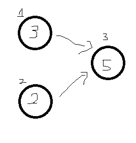
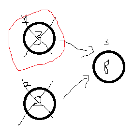

## Bài toán

Link đến bài toán: [2050. Parallel Courses III](https://leetcode.com/problems/parallel-courses-iii)

## Phân tích

Nếu nhìn vào các ví dụ cũng như hình minh họa, dễ dàng nhận thấy rằng đây là một bài toán topological sort.
Đối với các dạng bài topo sort, ta có thể sử dụng thuật toán [Kahn's algorithm](https://en.wikipedia.org/wiki/Topological_sorting#Kahn's_algorithm) để giải quyết.
Nhưng, các khóa học có thời gian hoàn thành khác nhau, nên ta sẽ cần chỉnh sửa thuật toán này một chút.

Nhìn vào ví dụ 1 của bài toán:


Ta nhận thấy rằng trong ta sẽ cần hoàn thành khóa học 1 và 2 trước khi có thể bắt đầu khóa học 3.
Cũng có thể nhận thấy rằng vì các khóa học sẽ được học song song, nên chỉ có thời gian của khóa học lớn nhất
(trong trường hợp này là khóa học 1) là thời gian ta cần quan tâm.



Vậy, ta sẽ cần một mảng `maxPerPath`, trong đó, `maxPerPath[i]` là thời gian ngắn nhất để hoàn thành khóa học `i`.

Ngoài ra, bài này cũng có thể sử dụng `DFS` kết hợp với mảng nhớ để giải quyết.

## Giải thuật

1. Khởi tạo mảng ma trận cạnh kề `adj` và mảng `inDegree` với `inDegree[i]` là số lượng cạnh vào đỉnh `i`.
2. Khởi tạo `queue` cho thuật toán `Kahn's algorithm`.
3. Khởi tạo mảng `maxPerPath`, với các đỉnh không có cạnh vào lúc khỏi tạo, `maxPerPath[i] = time[i]`.
4. Khi nào `queue` vẫn còn phần tử:
   1. Lấy đỉnh `u` đầu tiên trong `queue`.
   2. Duyệt qua các đỉnh `v` kề với `u`:
      1. `inDegree[v] -= 1`.
      2. `maxPerPath[v] = max(maxPerPath[v], maxPerPath[u] + time[v])`.
      3. Nếu `inDegree[v] == 0`, thêm `v` vào `queue`.
5. Kết quả trả về là phần tử lớn nhất trong `maxPerPath`.

```go
func minimumTime(n int, relations [][]int, time []int) int {
	inDegree := make([]int, n)
	adj := make(map[int][]int)
	for _, relation := range relations {
		adj[relation[0]-1] = append(adj[relation[0]-1], relation[1]-1)
		inDegree[relation[1]-1]++
	}

	queue := make([]int, 0)
	maxPerPath := make([]int, n)
	for i := 0; i < n; i++ {
		if inDegree[i] == 0 {
			queue = append(queue, i)
			maxPerPath[i] = time[i]
		}
	}

	for len(queue) > 0 {
		size := len(queue)
		for i := 0; i < size; i++ {
			node := queue[0]
			queue = queue[1:]
			for _, next := range adj[node] {
				inDegree[next]--
				if inDegree[next] == 0 {
					queue = append(queue, next)
				}

				maxPerPath[next] = max(maxPerPath[next], maxPerPath[node]+time[next])
			}
		}
	}

	res := 0
	for _, v := range maxPerPath {
		res = max(res, v)
	}

	return res
}
```

Độ phức tạp: ***O(N)***

Còn cách giải bằng DFS thì độc giả tự cài đặt nhé. Dễ mà /ᐠ - ˕ -マ Ⳋ