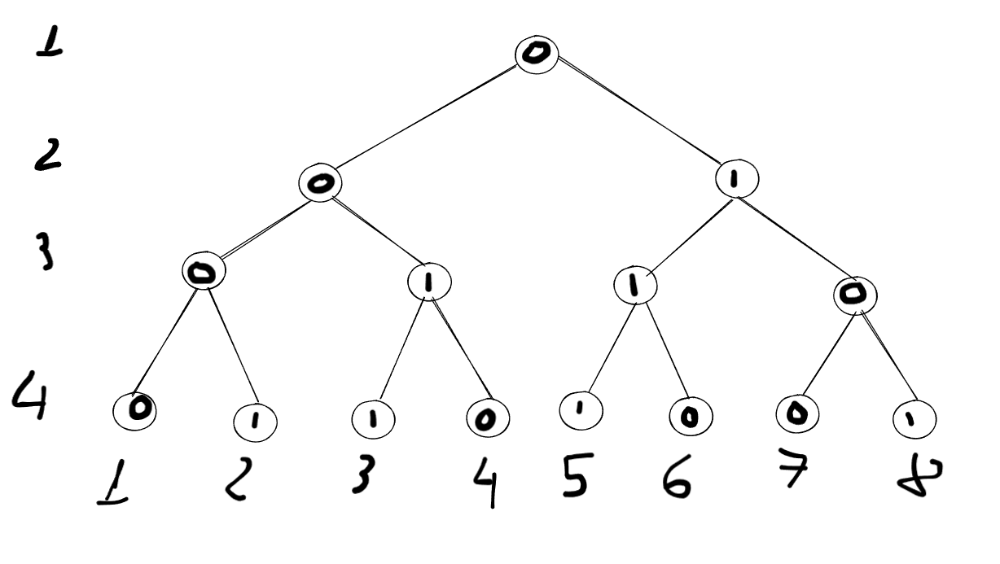
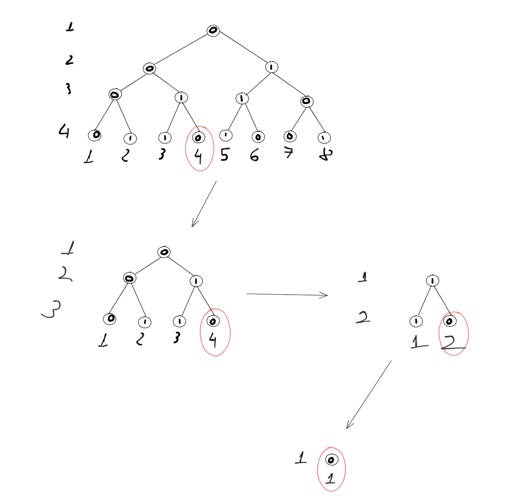

## Bài toán

Link đến bài toán: [779. K-th Symbol in Grammar](https://leetcode.com/problems/k-th-symbol-in-grammar/)

## Phân tích

Bài này khá thú vị, ta có thể giải bằng cách đệ quy.

Ta vẽ thử một ví dụ n = 4 ở dạng cây:


Giả sử, ta tìm k = 4, ta nhận thấy, k = 4 nằm phía bên trái của cây, nên ta sẽ tìm k = 4 trong cây con bên trái.
Và ta thấy, nếu ta bỏ cây con bên phải đi, thì cây con bên trái sẽ trở thành cây ở n = 3. vị trí của k = 4 chính là vị trí của k = 4 trong cây ở n = 3.
Nếu ta bỏ tiếp cây con bên trái đi, thì cây con bên phải sẽ trở thành cây ở n = 2 với bit đảo được (bit gốc = 1), vị trí k = 4 lúc này sẽ là k = 4 - 4 / 2 = 2.
Tương tự, bỏ tiếp cây bên trái đi, cây con bên phải trở thành cây n = 1 (bit gốc = 0), k = 2 lúc này là k = 2 - 2/2 = 1. 

Hình minh họa:


Ta có công thức đệ quy:

```
f(1, ?) = 0
f(n, k) = 1 - f(n - 1, k) nếu k > 2^(n - 1)
f(n, k) = f(n - 1, k) nếu k <= 2^(n - 1)
```

## Giải thuật

### Đệ quy

```go
func kthGrammar(n int, k int) int {
    if n == 1 {
        return 0
    }
    if k > (1 << (n - 2)) {
        return 1 - kthGrammar(n - 1, k - (1 << (n - 2)))
    }
    return kthGrammar(n - 1, k)
}
```

Ngoài ra, mình có thể tối ưu bằng cách khử đệ quy, các bạn tự cài đặt cho lên trình nhé. /ᐠ - ˕ -マ Ⳋ