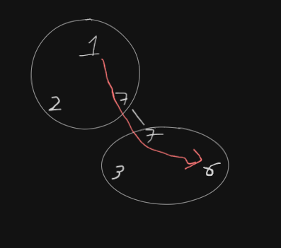

## Bài toán

Link đến bài toán: [815. Bus Routes](https://leetcode.com/problems/bus-routes/)

## Phân tích

Bài này hơi `hard` thật /ᐠﹷ ‸ ﹷ ᐟ\ﾉ.

Cơ bản thì có thể giải bằng cách coi mỗi trạm là một đỉnh, rồi dùng BFS.

Hoặc có thể coi cả một tuyến bus là một đỉnh, rồi dùng BFS luôn.



Cách sau tường minh hơn, nên mình sẽ giải theo cách sau.

## Giải thuật

1. Nếu `source == target` thì trả về `0`.
2. Tạo ma trận cạnh kề `adj`, `adj[i][j] = true` nếu có 2 tuyến bus `i` và `j` giao nhau.
3. Tạo một `map int -> []int` `bus` để lưu các tuyến bus đi qua mỗi trạm.
4. Duyệt qua `routes`, với mỗi tuyến bus `i`:
   1. Duyệt qua từng `route` i:
      1. Duyệt qua từng `stop`:
         1. Duyệt qua từng `route` j có chứa `stop`:
            1. set `adj[i][j] = true` và `adj[j][i] = true`.
         2. Thêm `i` vào `bus[stop]`.
5. Tạo queue `q`
6. Thêm các tuyến bus đi qua `source` vào `q`.
7. Tạo mảng `dist` với `dist[i]` là độ dài đường đi ngắn nhất từ `source` đến tuyến bus `i`, khởi tạo `dist[i] = -1`.
8. Chừng nào `q` chưa rỗng:
   1. Lấy một tuyến bus `i` ra khỏi `q`.
   2. Duyệt qua các tuyến bus `j` có cạnh với `i`:
      1. Nếu `dist[j] == -1`:
         1. `dist[j] = dist[i] + 1`
         2. Thêm `j` vào `q`.
9. Duyệt qua `dist`, trả về dist[i] nhỏ nhất và khác `-1`.
10. Nếu không tìm được đường đi thì trả về `-1`.

```go
func numBusesToDestination(routes [][]int, source int, target int) int {
    if source == target {
        return 0
    }
    adj := make([][]bool, len(routes))
    for i := range adj {
        adj[i] = make([]bool, len(routes))
    }
    bus := make(map[int][]int)
    for i, route := range routes {
        for _, stop := range route {
            for _, j := range bus[stop] {
                adj[i][j] = true
                adj[j][i] = true
            }
            bus[stop] = append(bus[stop], i)
        }
    }
    q := make([]int, 0, len(routes))
    for _, i := range bus[source] {
        q = append(q, i)
    }
    dist := make([]int, len(routes))
    for i := range dist {
        dist[i] = -1
    }
    for len(q) > 0 {
        i := q[0]
        q = q[1:]
        for j, ok := range adj[i] {
            if ok && dist[j] == -1 {
                dist[j] = dist[i] + 1
                q = append(q, j)
            }
        }
    }
    min := -1
    for _, d := range dist {
        if d != -1 && (min == -1 || d < min) {
            min = d
        }
    }
    return min
}
```