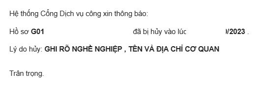

## Chuẩn bị

- Tài khoản dịch vụ công.
- Ảnh chuẩn passport, có thể tự chụp hoặc đi chụp ngoài.
- Máy tính có mạng internet.
- Thời gian rảnh trong giờ hành chính.

## Bước 1: Nộp hồ sơ
- Vào [link này](https://dichvucong.bocongan.gov.vn/bocongan/bothutuc/tthc?matt=29497) để nộp hồ sơ cấp tỉnh.
Từ lần thứ 2 trở về sau thì có thể vào [link này](https://dichvucong.bocongan.gov.vn/bocongan/bothutuc/tthc?matt=26270) để nộp hồ sơ cấp trung ương.
- Chọn `Nộp hồ sơ`.
- Đăng nhập vào tài khoản dịch vụ công.
- Chọn tỉnh thành, chọn `8 ngày - Cấp hộ chiếu phổ thông cho người đủ từ 14 tuổi`:

- Chọn `Đồng ý và tiếp tục`

- Lưu ý, nếu nộp hồ sơ ***ngoài giờ hành chính***, hệ thống sẽ báo lỗi liên quan tới màu nền của hình ảnh.
Thực tế thì hình ảnh không có vấn đề gì, bạn chờ vào giờ hành chính rồi nộp lại thôi. /ᐠ - ˕ -マ Ⳋ
- Điền, kiểm tra đầy đủ các thông tin bên dưới
- Lưu ý, mục 10 và 11 tuy không yêu cầu, nhưng nếu không điền thì hồ sơ sẽ bị từ chối. (  •̀ - •́  )

- Ở mục `Chọn loại hộ chiếu đề nghị cấp`, nhớ tick vào `Cấp hộ chiếu có gắn chip điện tử`
- Chọn `Nơi nhận hộ chiếu` là `Nhận trực tiếp` nếu bạn rảnh, còn không thì chọn `Nhận qua bưu chính`, sau đó điền địa chỉ nhận hộ chiếu ở dưới.
- Ở mục `Đăng ký thông tin hoàn tiền`, nhập thông tin chuyển khoản để hoàn tiền phí dịch vụ nếu có vấn đề gì xảy ra.
- Upload các file ảnh giấy tờ lên nếu là làm lại hộ chiếu do mất hộ chiếu, do hết hạn, etc.
- Chọn `Đồng ý và tiếp tục`

## Bước 2: Chờ đợi và đóng phí
- Chờ 1-2 ngày làm việc, mình sẽ nhận được 1 cái email từ chối tiếp nhận hồ sơ nếu có vấn đề gì xảy ra.
- Hoặc mình sẽ nhận được 1 cái email đóng phí, trong đó có 1 cái link, bấm vào link đó để thanh toán phí dịch vụ.
- Nếu vì một lí do gì đó, bạn _lỡ tay_ xóa cái email,
hoặc hệ thống không gửi link qua email thì có thể vào tài khoản dịch vụ công, chọn `Quản lý hồ sơ đã nộp`, bấm `Chi tiết`,
nếu chưa thanh toán thì ở dưới cuối sẽ có nút để thanh toán (Thanh toán qua Momo, eBanking, etc.)
- Sau khi thanh toán xong thì nút thanh toán ở trên sẽ trở thành nút lấy biên lai.

## Bước 3: Đợi chờ và nhận hộ chiếu
- Sau khoảng 6-8 ngày làm việc gì đấy, trạng thái hồ sơ sẽ chuyển sang `Đã xử lý`.
Lúc này mình có thể đến trực tiếp để nhận hộ chiếu.
Còn nếu chọn nhận qua bưu chính thì bưu điện sẽ giao hộ chiếu đến địa chỉ đã đăng ký,
mình thanh toán phí ship ***trực tiếp*** cho bưu tá, không thanh toán trước để tránh bị lừa đảo.

---
Hết rùi. /ᐠ - ˕ -マ